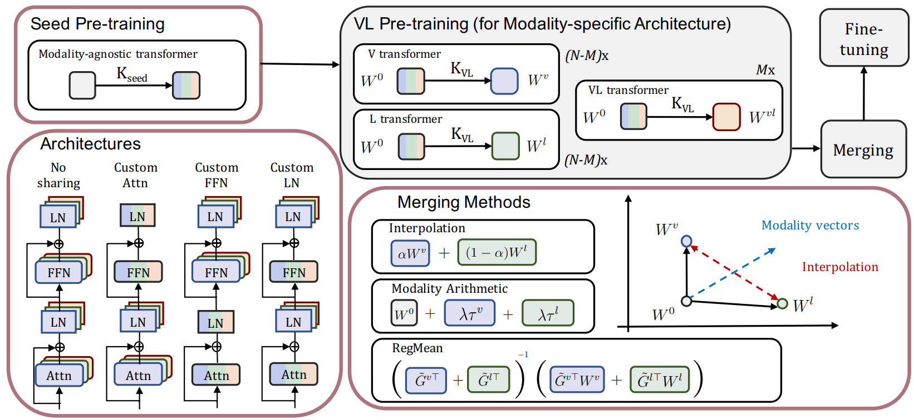

# VL Model Merging

* Authors: [Yi-Lin Sung](https://ylsung.github.io/), [Linjie Li](https://www.microsoft.com/en-us/research/people/linjli/), [Kevin Lin](https://www.bing.com/search?q=kevin+lin+microsoft&cvid=d33faa908e314098849bfd0c8b20b95a&aqs=edge.0.0.13028j0j4&FORM=ANAB01&PC=U531), [Zhe Gan](https://zhegan27.github.io/), [Mohit Bansal](https://www.cs.unc.edu/~mbansal/), [Lijuan Wang](https://www.microsoft.com/en-us/research/people/lijuanw/)
* Paper: [An Empirical Study of Multimodal Model Merging](https://arxiv.org/abs/2304.14933)



## Environment

```bash
alias=`whoami | cut -d'.' -f2`; docker run -it --rm --runtime=nvidia --ipc=host --privileged -v /home/${alias}:/home/${alias} louis2889184/vilt:torch-1.10.2 bash
```

Please do everything in the `/src` folder.

```bash
pip install -r requirements
pip install -e .
```

In order to perform [sharded training](https://pytorch-lightning.readthedocs.io/en/stable/advanced/advanced_gpu.html#sharded-training), we need to install the following packages.

```bash
pip install fairscale==0.4.0
```

## Pre-training Data

The pre-training data consists of four image captioning datasets: Conceptual Captions, SBU Captions, COCO and Visual Genome (VG) datasets.
We convert the data to Apache arrow format following [DATA.md](https://github.com/wenhui0924/vlmo-ms/blob/main/src/DATA.md)

## Teminology

In codes, some parameter names are not directly the same to the paper, and they are

* ufo = modality-agnostic model (inspired from [here](https://www.bing.com/search?q=UFO+vision+and+language+paper&qs=n&form=QBRE&sp=-1&lq=0&pq=ufo+vision+and+language+paper&sc=10-29&sk=&cvid=0F3FE1344EAF48869FA99DF488FEEE90&ghsh=0&ghacc=0&ghpl=))
* all moe = modality-specific model (inspired from [here](https://arxiv.org/abs/2111.02358))

## Evaluation Pipeline

* For modality-agnostic model

`Modality-agnostic pre-training ->  Modality-agnostic fine-tuning`

* For modality-specific model

`Modality-specific pre-training ->  Modality-specific fine-tuning`

* For models merged from modality-specific model

`Seed (modality-agnostic) pre-training -> Modality-specific pre-training -> Merge and do modality-agnostic fine-tuning`

## Pre-training

I use [this beit weight](https://conversationhub.blob.core.windows.net/beit-share-public/beit/beit_base_patch16_224_pt22k_ft22k.pth) as the pre-trained weight, but you can use [this one](https://conversationhub.blob.core.windows.net/beit-share-public/beit/beit_base_patch16_224_pt22k_ft22kto1k.pth) instead and performance might be better.

#### Seed (modalty-agnostic) pre-training

Note that the seed pre-training in the paper only uses 100k steps, so please change it accordingly.

```bash
# run pre-training

log_dir=[The directory to store checkpoints and logs]
load_path=[Pre-trained weight (end with .ckpt)]

python run.py with num_gpus=8 num_nodes=6 task_mlm_itm_ifm_square_randaug_base_vl
    exp_name=ma_200k_vlpt
    whole_word_masking=True step200k per_gpu_batchsize=22 batch_size=1056
    log_dir=${log_dir} load_path=${load_path} use_beit_weight=True 
    num_workers=16 use_sharded_training=True vl_mlm_prob=0.25 ufo
```

#### Modalty-specific pre-training

The pre-trained weight can be either the beit weight or the weight that trained from the seed pre-trainining.

```bash
# run pre-training

log_dir=[The directory to store checkpoints and logs]
load_path=[Pre-trained weight (end with .ckpt)]

python run.py with num_gpus=8 num_nodes=6 task_mlm_itm_ifm_square_randaug_base_vl
    exp_name=ms_200k_vlpt
    whole_word_masking=True step200k per_gpu_batchsize=22 batch_size=1056
    log_dir=${log_dir} load_path=${load_path} use_beit_weight=True 
    num_workers=16 use_sharded_training=True all_moe vl_mlm_prob=0.25 use_vision_weights_for_other_modalities=True
```

- `use_sharded_training=True`: use sharded training

## Fine-tuning on COCO

* Fine-tuning for modality-agnostic model

```bash
# run fine-tuning

data_dir=[Path to COCO dataset]
log_dir=[The directory to store checkpoints and logs]
load_path=[Pre-trained weight (end with .ckpt)]

python run.py with data_root=${data_dir} num_gpus=8 num_nodes=4 task_finetune_irtr_coco_square_randaug_base_image384 
    exp_name=ma_coco_finetuning
    per_gpu_batchsize=20 batch_size=640 learning_rate=6.25e-6
    load_path=${load_path} log_dir=${log_dir} ufo
```

- Fine-tuning for modality-specific model

```bash
# run fine-tuning

data_dir=[Path to COCO dataset]
log_dir=[The directory to store checkpoints and logs]
load_path=[Pre-trained weight (end with .ckpt)]

python run.py with data_root=${data_dir} num_gpus=8 num_nodes=4 task_finetune_irtr_coco_square_randaug_base_image384 
    exp_name=ms_coco_finetuning
    per_gpu_batchsize=20 batch_size=640 learning_rate=6.25e-6
    load_path=${load_path} log_dir=${log_dir} all_moe
```

* Fine-tuning for model merging from modality-specific model. The weight after fine-tuning will have the same size as a modality-agnostic model, so treat it as a modality-agnostic model after merging.

Remember to use modality-specific pre-trained weight, the code will merge the model and do fine-tuning.

```bash
# run interpolation

data_dir=[Path to COCO dataset]
log_dir=[The directory to store checkpoints and logs]
load_path=[Pre-trained weight (end with .ckpt)]

python run.py with data_root=${data_dir} num_gpus=8 num_nodes=4 task_finetune_irtr_coco_square_randaug_base_image384 
    exp_name=inter0.5_ms_coco_finetuning
    per_gpu_batchsize=20 batch_size=640 learning_rate=6.25e-6
    load_path=${load_path} log_dir=${log_dir} ufo merge_weights=True merge_ratio=0.5
```

```bash
# run modality arithmetic

# The `central weight` is like the origin for computing the modality vectors, and it is the seed pre-training weight in our case. `load_path` is the weight after VL pre-training.

data_dir=[Path to COCO dataset]
log_dir=[The directory to store checkpoints and logs]
load_path=[VL Pre-trained weight (end with .ckpt)]
central_weight=[The weight got from seed pre-training]

python run.py with data_root=${data_dir} num_gpus=8 num_nodes=4 task_finetune_irtr_coco_square_randaug_base_image384 
    exp_name=arithmetic0.75_ms_coco_finetuning
    per_gpu_batchsize=20 batch_size=640 learning_rate=6.25e-6
    load_path=${load_path} log_dir=${log_dir} central_weight=${central_weight} ufo sum_task_vectors=True sum_lambda=0.75 
```

```bash
# run RegMean

data_dir=[Path to COCO dataset]
log_dir=[The directory to store checkpoints and logs]
load_path=[VL modality-specific pre-trained weight (end with .ckpt)]
gram_matrices=[Pre-extracted gram matrices (got from cache_gram_matrices.py) name example: gram_matrices]

# Compute the gram matrices
python cache_gram_matrices.py with data_root=${data_dir} num_gpus=1 num_nodes=1
    task_finetune_irtr_coco_square_randaug_base_image384 
    exp_name=coco_ma_gram_matrices
    per_gpu_batchsize=160 batch_size=160 image_size=224 load_path=${load_path}
    log_dir=${log_dir}/ all_moe representation_name=${gram_matrices} get_recall_metric=False

python run.py with data_root=${data_dir} num_gpus=8 num_nodes=4 task_finetune_irtr_coco_square_randaug_base_image384 
    exp_name=inter0.5_ms_coco_finetuning
    per_gpu_batchsize=20 batch_size=640 learning_rate=6.25e-6
    load_path=${load_path} log_dir=${log_dir} ufo regmean=True scaling_for_non_diag=1.0 
    gram_matrices=${gram_matrices}.pth
```

## Fine-tuning on VQA (480x480image)

* Fine-tuning for modality-agnostic model (The other approaches please copy the script changes from COCO to the following script)

```bash
# run fine-tuning

data_dir=[Path to VQA dataset]
log_dir=[The directory to store checkpoints and logs]
load_path=[VL modality-agnostic pre-trained weight (end with .ckpt)]

python run.py with data_root=${data_dir} num_gpus=8 num_nodes=4 task_finetune_vqa_square_randaug_base_image384_ufo 
    exp_name=ma_vqa_finetuning per_gpu_batchsize=4 batch_size=128 image_size=480 learning_rate=3e-5
    load_path=${load_path} log_dir=${log_dir} drop_rate=0.15 max_epoch=10 ufo
```

## Inference on VQA (480x480image)

* Inference for modality-agnostic and the merged model (The modality-specific approaches please copy the script changes from COCO to the following script)

```bash
# run inference

data_dir=[Path to VQA dataset]
log_dir=[The directory to store checkpoints and logs]
load_path=[VQA fine-tuned weight (end with .ckpt)]

python run.py with data_root=${data_dir} num_gpus=8 num_nodes=1 task_finetune_vqa_square_randaug_base_image384_ufo 
    exp_name=test
    per_gpu_batchsize=32 batch_size=256 image_size=480 load_path=${load_path} 
    log_dir=${log_dir} ufo test_only=True
```

## Reference

Please consider to cite our work if you use the code for your projects.

```bibtex
@inproceedings{Sung2023AnEmpiricalSO,
      title={An Empirical Study of Multimodal Model Merging}, 
      author={Yi-Lin Sung and Linjie Li and Kevin Lin and Zhe Gan and Mohit Bansal and Lijuan Wang},
      year={2023},
      eprint={2304.14933},
      archivePrefix={arXiv},
      primaryClass={cs.CV}
}
```